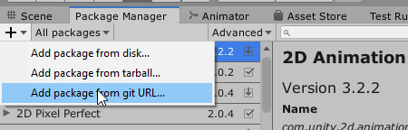
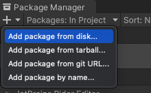

# Agent of Internet Computer for Unity

## The Intro

The project brings the `IC` ecosystem to `Unity`, allowing Unity developers to call the functions of canisters on IC,
providing useful utilities to make authentication and authorization easy.


## The Status

The project is in an early stage, feature-less, documentation-sparse, and API will be changed frequently.

__NOTE__: __Beta version is available, Only for experiment!__

## Milestones

### Milestone 01: 【Draft】Call IC methods on Unity3D

- [x] ✨ Support `HostKeyStore`, a simple encrypted account module;
- [x] ✨ Support login/logout by `HostKeyStore`;
- [x] ✨ Call query methods on ic mainnet;
- [x] ✨ Call update methods on ic mainnet;
- [x] ✨ Support target: x86_64-win;
- [x] ✨ Support target: x86_64-nix;
- [x] ✨ Support target: aarch64-osx;
- [ ] ✨ Support target: x86_64-osx;

### Milestone 02: 【Basic】Core features/libraries mapping

- [ ] ✨ Mapping `candid` from rs to cs;
- [ ] ✨ Mapping `ic-types` from rs to cs;
- [ ] ✨ Mapping `ic-agent` from rs to cs;
- [ ] ✨ Mapping `ic-utils` from rs to cs;

### Milestone 03: 【Enhancement】Provide helpful utilities for Unity3D Devs

- [ ] ✨ Candid file downloader(For hot-update);
- [ ] ✨ Encrypted account file module;
- [ ] ✨ Authentication & Authorization by II;

## How to build

```sh
# init python env
sh ./init.sh

# make the unity package, will produce a unity package with four targets:
# x86_64-win, x86_64-nix, x86_64-osx, aarch64-win
./publish --release --input=all
```

Look the __[detail](./scripts/README.md)__.

## How to install

- Install of the official UPM package

    __TODO__

- Installation via Git in UPM

    

    ```
    https://github.com/ShikuLabs/agent-unity#upm
    ```

- Installation via

    

    __NOTE__: The installation file will be put on __Release__ page.

## How to use

```cs
using IC;

// Create keyStore
var keyStore = Agent.CreateKeyStore("Name", "Password");

// Login & Get login receipt
var receipt = Agent.LoginByHost(keyStore, "Password");

// Call query & update functions on ic mainneet
//
// Use II(Internet Identity Canister) as an instance:
//
// 1. Load candid file
// __NOTE__:
//      II_CANISTER_ID = rdmx6-jaaaa-aaaaa-aaadq-cai
//      II_CANDID_FILE: Get from https://k7gat-daaaa-aaaae-qaahq-cai.raw.ic0.app/listing/internet-identity-10235/rdmx6-jaaaa-aaaaa-aaadq-cai
Agent.RegisterIdl(II_CANISTER_ID, II_CANDID_FILE);

// 2. Call query function
// __NOTE__: The function will return a struct which is serialized, that representation is literal;
string rstStrQ = Agent.QuerySync(receipt.Principal, II_CANISTER_ID, "lookup", "(1974210: nat64)");

// 3. Call update function
string rstStrU = Agent.UpdateSync(receipt.Principal, II_CANISTER_ID, "create_challenge", "()");

// Logout
Agent.Logout(receipt.Principal);
```